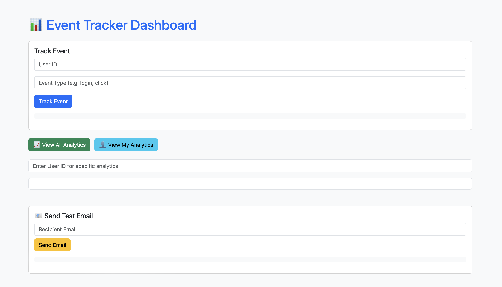

# 📊 Event Tracker API with Email Notification

A Spring Boot application that tracks user events and sends email notifications. It also provides APIs to fetch analytics data and view all tracked events.

---

## 🚀 Features

- ✅ Track user events via REST API
- ✅ Store events in a database
- ✅ Send email notifications when events are tracked
- ✅ View analytics summary of events by type
- ✅ Retrieve all stored events
- ✅ Frontend form to track events and send test emails (if added)

---

## 🛠️ Tech Stack

- **Backend**: Java, Spring Boot, Spring Data JPA
- **Database**: MySQL 
- **Email**: Spring Boot Mail Sender (SMTP)
- **Frontend (optional)**: HTML + JS 

---
---

## 🖼️ Dashboard Preview



## 📂 Project Structure

```
eventtracker/
├── src/
│   ├── main/
│   │   ├── java/com/example/eventtracker/
│   │   │   ├── controller/
│   │   │   │   ├── EventController.java
│   │   │   │   └── EmailController.java
│   │   │   ├── model/
│   │   │   │   └── Event.java
│   │   │   ├── repository/
│   │   │   │   └── EventRepository.java
│   │   │   ├── services/
│   │   │   │   └── EmailService.java
│   │   │   └── EventtrackerApplication.java
│   └── resources/
│       └── application.properties
└── README.md
```

---

## 📦 How to Run

### 1. Clone the Repository

```bash
git clone https://github.com/your-username/event-tracker.git
cd event-tracker
```

### 2. Configure Email

In `src/main/resources/application.properties`, set your SMTP credentials:

```properties
spring.mail.host=smtp.gmail.com
spring.mail.port=587
spring.mail.username=your_email@gmail.com
spring.mail.password=your_app_password
spring.mail.properties.mail.smtp.auth=true
spring.mail.properties.mail.smtp.starttls.enable=true
```

### 3. Run the App

```bash
./mvnw spring-boot:run
```

App will be running at: `http://localhost:8080`

---

## 📬 API Endpoints

| Method | Endpoint                          | Description                            |
|--------|-----------------------------------|----------------------------------------|
| POST   | `/api/events`                     | Track an event and send email          |
| GET    | `/api/events`                     | Get all tracked events                 |
| GET    | `/api/analytics`                  | Get event analytics summary            |
| POST   | `/api/send-email`                 | Send custom email (test endpoint)      |

---

## 📦 Example Payloads

### ➕ Track Event

```http
POST /api/events
Content-Type: application/json

{
  "userId": "user123",
  "eventType": "LOGIN"
}
```

### ✉️ Send Test Email

```http
POST /api/send-email?toEmail=test@example.com&subject=Hello&body=This+is+a+test
```

---

## 🧪 Testing Locally

You can use [Postman](https://www.postman.com/) or [curl](https://curl.se/) to test the API.

---


